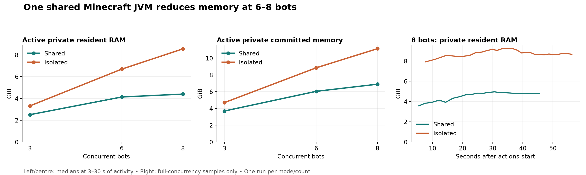

# Shared versus isolated memory — 5 September 2026

This experiment measures the process memory cost of 3, 6 and 8 concurrent Mine AI
bots, comparing one shared Minecraft JVM with one JVM per bot. It complements
the [three-bot throughput benchmark](verification-benchmark.md).

## Results

Median private resident RAM for Java + clients + harness:

| Bots | Shared idle | Isolated idle | Shared active | Isolated active | Active reduction |
| ---: | ---: | ---: | ---: | ---: | ---: |
| 3 | 1.47 GiB | 2.88 GiB | 2.51 GiB | 3.32 GiB | 24.3% |
| 6 | 2.13 GiB | 5.69 GiB | 4.13 GiB | 6.69 GiB | 38.2% |
| 8 | 2.40 GiB | 7.51 GiB | 4.40 GiB | 8.55 GiB | 48.6% |

**Active comparisons use seconds 3–30 after the common start signal.** Every
sample in this interval retained the requested worker and JVM counts in all
six runs. Location 4 subsequently failed to find a path in some runs; later
samples with fewer workers are excluded rather than counted as cheaper memory.



Active-window breakdown (component medians) and aggregate sampled peak:

| Bots | Mode | Java RAM | Client RAM | Harness RAM | Total RAM peak | Private commit median |
| ---: | --- | ---: | ---: | ---: | ---: | ---: |
| 3 | shared | 1.47 GiB | 1.01 GiB | 0.04 GiB | 2.65 GiB | 3.70 GiB |
| 3 | isolated | 2.32 GiB | 0.96 GiB | 0.04 GiB | 3.55 GiB | 4.70 GiB |
| 6 | shared | 2.00 GiB | 2.01 GiB | 0.04 GiB | 4.56 GiB | 6.04 GiB |
| 6 | isolated | 4.65 GiB | 2.00 GiB | 0.04 GiB | 7.17 GiB | 8.85 GiB |
| 8 | shared | 1.96 GiB | 2.39 GiB | 0.04 GiB | 4.91 GiB | 6.89 GiB |
| 8 | isolated | 6.17 GiB | 2.34 GiB | 0.04 GiB | 9.15 GiB | 11.13 GiB |

From six to eight bots, shared active RAM grew by 0.27 GiB
(6.4%), versus 1.86 GiB
(27.8%) isolated. The shared Java component stayed near 2 GiB
in this window, while isolated Java memory scaled with server count. Client
memory still increases: the combined footprint is flatter, not constant.

These measurements support sharing servers to fit more concurrent clients
within a memory budget. They do not establish a speed-up at six or eight bots.

| Bots | Mode | Idle samples | Active comparison samples | Full-N active samples over 90 s |
| ---: | --- | ---: | ---: | ---: |
| 3 | shared | 21 | 19 | 67/67 |
| 3 | isolated | 20 | 21 | 67/67 |
| 6 | shared | 18 | 15 | 25/57 |
| 6 | isolated | 14 | 16 | 24/58 |
| 8 | shared | 14 | 12 | 21/43 |
| 8 | isolated | 4 | 9 | 26/47 |

## Method

Each mode/count receives a fresh world, using seed `8675309` and the first N
locations below. The existing obsidian collector runs through the normal client
host. A temporary wrapper waits until every client is ready, holds all clients
connected for 30 seconds, then starts collection together. After 90 seconds of
active work the harness cancels the batch. The request is 32 obsidian, with the
normal inventory and survival/completion goal. This is a bounded memory workload,
not a full-goal pass-rate or throughput benchmark.

| Location | X | Y | Z |
| --- | ---: | ---: | ---: |
| 1 | -742.5 | 104 | 872.5 |
| 2 | 1543.5 | 75 | 1662.5 |
| 3 | -2014.5 | 103 | 776.5 |
| 4 | -4483.5 | 64 | 846.5 |
| 5 | -5601.5 | 79 | 732.5 |
| 6 | -6804.5 | 76 | 725.5 |
| 7 | -7902.5 | 69 | 897.5 |
| 8 | 43.5 | 76 | 1501.5 |

These positions were surveyed with an actual connected bot on the generated
world, checking grounded positions above solid blocks. Some starts are on tree
leaves. All declared radius-256 regions have enough separation to share a batch.

Windows host: AMD Ryzen 7 9800X3D, 16 logical processors, 63.6 GiB installed RAM.
Minecraft Java 1.21.4, each JVM `-Xms512M -Xmx2G`, view and simulation distances 8.
No heap changes were made between modes. Runs execute sequentially in this order:
shared 3, isolated 3, isolated 6, shared 6, shared 8, isolated 8. There is one run
per mode/count. Other unrelated host workloads are excluded from attribution but
can still affect scheduling and memory pressure.

An external PowerShell sampler follows the launched harness's process descendants
and reads Windows counters with a one-second pause between polls (counter reads
add overhead, making the actual interval longer under load). It records Java,
client processes (including their small Bun launch shims), and the harness.
The sampler itself is excluded. Nothing was added to Mine Labs' production
runner to collect client memory.

- **Private resident RAM:** `Win32_PerfRawData_PerfProc_Process.WorkingSetPrivate`.
  This counts resident private pages without counting shared pages repeatedly
  across processes. It omits genuinely shared resident pages and is therefore
  not a complete measure of system RAM consumption.
- **Private committed memory:** `Process.PrivateMemorySize64`, an allocation
  measure that includes memory which may not currently be resident.
- The raw evidence also retains `Process.WorkingSet64`, whose sum can count
  shared resident pages more than once. See Microsoft's documentation for
  [working sets](https://learn.microsoft.com/en-us/dotnet/api/system.diagnostics.process.workingset64)
  and [private memory](https://learn.microsoft.com/en-us/dotnet/api/system.diagnostics.process.privatememorysize64).

Statistics exclude the first three seconds of each phase and require N live
client workers, the expected Java process count, and available counters for all
attributed processes. Every total is summed at each timestamp before computing
its median or peak. Component medians need not add exactly to the total median.

## Evidence and reproduction

Local raw samples, events, resolved inputs and client/server logs live under
`.mine-labs/memory-profile/`. The external scripts are `profile.ps1`, `run.ts`,
`client.ts`, and `analyze.py` in that directory. For example, from Mine Labs:

```powershell
& .\.mine-labs\memory-profile\profile.ps1 -Mode shared -Bots 8 -RunName shared-8-repeat
& .\.mine-labs\memory-profile\profile.ps1 -Mode isolated -Bots 8 -RunName isolated-8-repeat
```

Use a new run name for each fresh-world measurement. These scratch scripts and
raw logs are ignored by Git; the result tables and chart in this document retain
the measurements for other checkouts. An initial pilot with an invalid request
of 64 items was rejected by the action's maximum of 32 and is excluded.

The short observation window does not establish long-session steady state,
leak behavior, or a maximum safe bot count. Clients and loaded world regions
still grow with concurrency even when Java's fixed overhead is shared.
